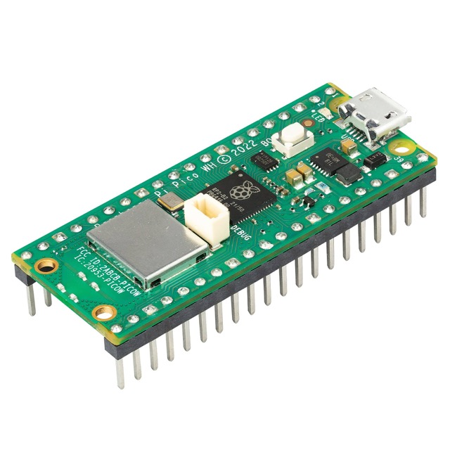
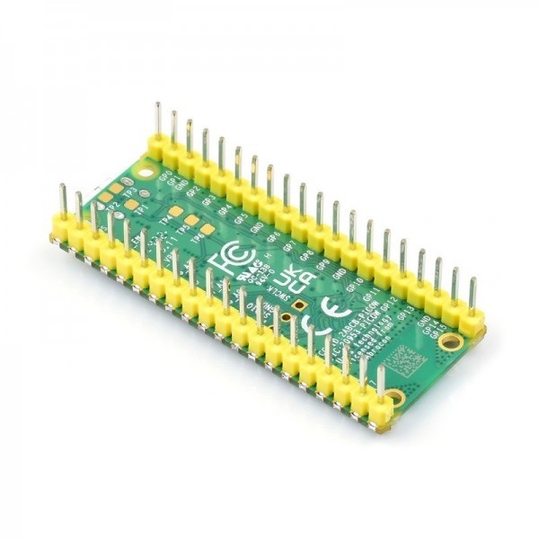
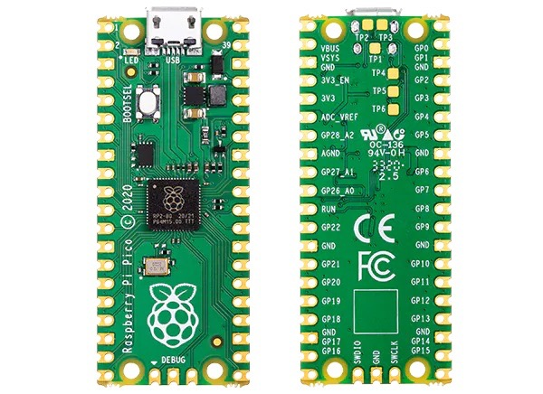
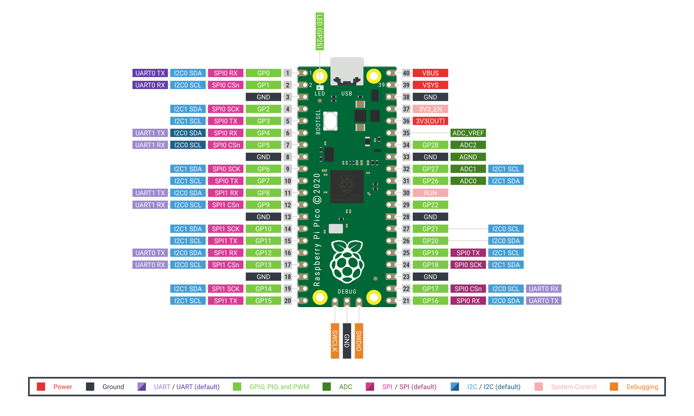

# Raspberry Pi Pico Servidor de websockets básico

Este repositorio contiene un ejemplo de servidor websockets para la
raspberry pi pico de forma que podemos enviarle/recibir datos desde/hacia 
nuestro equipo u otros dispositivos para comunicarnos ya sea leyendo sensores
o actualizando la información mostrada en una pantalla.

Un ejemplo del uso que yo le di lo puedes ver aquí: ["Pantalla para contador de pulsaciones usando websockets"](https://youtu.be/Tvh2LaYt-_s)

Puedes utilizar este código de ejemplo para adaptarlo a tu proyecto.

Sitio web del autor: [https://raupulus.dev](https://raupulus.dev)


Repository [https://gitlab.com/raupulus/rpi-pico-simple-websockets-server](https://gitlab.com/raupulus/rpi-pico-simple-websockets-server)

Modelo para acciones que suelo usar recurrente en raspberry pi pico:

- RpiPico: Representa a la raspberry: incluye conectividad wireless, gestión de
  ADC integrado, puede obtener información de la red y conectar a redes 
  alternativas por si nos desplazamos (usamos en varias ubicaciones) o 
  necesitamos un respaldo, información de temperatura...

Además de algunos parámetros básicos en el archivo de variables de entorno
que usamos como base **.env.example.py**

<p align="center">
  
  
  
  
</p>

## Software y Firmware

- IDE/Editor (EJ: thonny, pycharm o vscode)
- [MicroPython 1.23](https://micropython.org/download/rp2-pico/) instalado 
  en la Raspberry Pi Pico.

## Contenido del Repositorio

- **src/**: Código fuente del proyecto.
- **src/Models**: Modelos/Clases para separar entidades que intervienen.
- **docs/**: Documentación adicional e imágenes.

## Instalación

1. **Instalación de MicroPython:**
   - Asegúrate de que MicroPython esté instalado en tu Raspberry Pi Pico. Puedes seguir las instrucciones en la [documentación oficial](https://docs.micropython.org/en/latest/rp2/quickref.html).

2. **Cargar el Código:**
   - Descarga o clona este repositorio.
   - Copia el archivo *.env.example.py* a *env.py* y rellena los datos para 
     conectar al wireless.
   - Copia los archivos en la carpeta `src/` a la Raspberry Pi Pico.

## Probar conexión al socket

He dejado un script que actúa como cliente y lo podemos ejecutar en nuestro
propio equipo para comprobar que la raspberry pi pico responde correctamente
a las peticiones.

Este archivo es **client_example.py**, tienes que editar la dirección IP a la
que conectarás añadiendo la de tu raspberry pi pico en tu red local y ya puedes
ejecutarlo así desde el terminal:

```bash
python client_example.py
```

Si todo va bien, deberías recibir por el terminal un "status: ok" además de 
todos los datos enviados.


## Esquema de la raspberry pi pico



## Licencia

Este proyecto está licenciado bajo la Licencia GPLv3. Consulta el archivo 
LICENSE para más detalles.