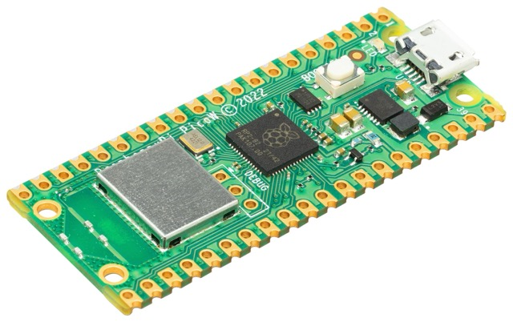

# Raspberry Pi Pico Servidor de Websockets Básico

Este repositorio contiene un ejemplo de servidor WebSocket para la Raspberry Pi Pico, de forma que podamos enviar y recibir datos desde/hacia nuestro equipo u otros dispositivos. Este servidor se puede utilizar para aplicaciones como leer sensores, actualizar información en una pantalla, o controlar dispositivos como LEDs, motores, y más, a través de una conexión WebSocket.

Un ejemplo del uso que yo le di lo puedes ver aquí: ["Pantalla para contador de pulsaciones usando WebSockets"](https://youtu.be/Tvh2LaYt-_s)

Puedes utilizar este código de ejemplo para adaptarlo a tu proyecto.

Sitio web del autor: [https://raupulus.dev](https://raupulus.dev)



Repositorio: [https://gitlab.com/raupulus/rpi-pico-simple-websockets-server](https://gitlab.com/raupulus/rpi-pico-simple-websockets-server)

## ¿Qué es WebSocket?

WebSocket es un protocolo de comunicación que proporciona un canal de comunicación full-duplex sobre una única conexión TCP. A diferencia de HTTP, que es un protocolo sin estado, WebSocket permite la comunicación bidireccional entre el cliente y el servidor en tiempo real.

En este proyecto, el servidor WebSocket corre en la Raspberry Pi Pico, permitiendo que otros dispositivos (como tu PC o teléfono) se conecten al servidor y envíen/reciban datos para interactuar con la Raspberry Pi Pico.

## Funcionalidad del Proyecto

Este proyecto incluye un servidor WebSocket básico que:

- Recibe comandos JSON para encender o apagar LEDs conectados a la Raspberry Pi Pico.
- Los LEDs son controlados a través de las funciones `led_on()` y `led_off()` de la clase `RpiPico`, que pueden controlar el LED integrado, el LED 1 (GPIO 1) o el LED 2 (GPIO 2).

### Casos de Uso

Algunos ejemplos prácticos de cómo podrías utilizar este servidor WebSocket incluyen:

- **Control de LEDs**: Puedes encender o apagar LEDs desde un dispositivo remoto (como tu PC o teléfono móvil).
- **Lectura de Sensores**: Leer datos de sensores conectados a la Raspberry Pi Pico y enviar esos datos a un servidor o aplicación web.
- **Contadores en Tiempo Real**: Mostrar en tiempo real información como el número de pulsaciones, el conteo de objetos o la temperatura.

## Software y Firmware

Para este proyecto necesitarás:

- **IDE/Editor**: Puedes usar cualquier editor de código compatible con MicroPython, como Thonny, PyCharm o Visual Studio Code.
- **MicroPython**: Este proyecto está diseñado para funcionar con [MicroPython 1.23](https://micropython.org/download/rp2-pico/) en la Raspberry Pi Pico.

## Contenido del Repositorio

- **src/**: Código fuente del proyecto.
- **src/Models/**: Clases para gestionar el hardware de la Raspberry Pi Pico, como los LEDs y la conexión WiFi.
- **docs/**: Documentación adicional e imágenes.

## Instalación

### 1. Instalación de MicroPython

- Asegúrate de que MicroPython esté instalado en tu Raspberry Pi Pico. Puedes seguir las instrucciones en la [documentación oficial de MicroPython](https://docs.micropython.org/en/latest/rp2/quickref.html).

### 2. Cargar el Código

- Clona este repositorio o descarga los archivos.
- Copia el archivo `*.env.example.py*` a `env.py` y configura tus parámetros de red, como el nombre de la red Wi-Fi y la contraseña.
- Copia los archivos en la carpeta `src/` a la Raspberry Pi Pico utilizando un editor de MicroPython como Thonny o directamente desde la terminal.

## Probar Conexión al WebSocket

Este repositorio incluye un script que actúa como cliente WebSocket. Puedes ejecutarlo en tu PC para comprobar que el servidor WebSocket en la Raspberry Pi Pico está funcionando correctamente.

### **`client_example.py`**

Este script envía un comando al servidor WebSocket para controlar los LEDs de la Raspberry Pi Pico. Debes editar la dirección IP del servidor (tu Raspberry Pi Pico) en el script antes de ejecutarlo.

### Uso básico:

```bash
python client_example.py integrated on
```

Esto enviará un comando para encender el LED integrado de la Raspberry Pi Pico.

### Otro ejemplo:

```bash
python client_example.py 1 off
```

Este comando apagará el LED 1 (conectado a GPIO 1).

Si todo va bien, deberías recibir en tu terminal un mensaje de confirmación con el estado "ok" y los datos enviados.

### Parámetros de línea de comandos

- **LED**: Puede ser `integrated`, `1`, o `2`.
- **Acción**: Puede ser `on` o `off`.

### Ejemplo de ejecución

```bash
python client_example.py integrated on
```

Esto encenderá el LED integrado de la Raspberry Pi Pico.

```bash
python client_example.py 1 off
```

Esto apagará el LED 1 (conectado a GPIO 1) de la Raspberry Pi Pico.

## Cómo Funciona el Servidor WebSocket

El servidor WebSocket en la Raspberry Pi Pico está diseñado para:

1. **Escuchar las conexiones entrantes** en el puerto 80.
2. **Aceptar las conexiones** y esperar mensajes en formato JSON.
3. **Procesar los mensajes**: Basado en los datos recibidos (como el nombre del LED y la acción), el servidor controla los LEDs de la Raspberry Pi Pico.
4. **Responder al cliente**: Después de procesar la acción, el servidor envía una respuesta en formato JSON al cliente con el estado de la operación.

### Protocolo de Comunicación

El formato de los mensajes enviados y recibidos es JSON. El cliente debe enviar un mensaje con los campos `action` (que puede ser `on` o `off`) y `led` (que puede ser `integrated`, `1`, o `2`).

Ejemplo de un mensaje JSON enviado desde el cliente:

```json
{
  "action": "on",
  "led": "integrated"
}
```

El servidor responde con un mensaje que indica que la acción se ha completado correctamente:

```json
{
  "status": "ok",
  "data": {
    "action": "on",
    "led": "integrated"
  }
}
```

## Consejos y Buenas Prácticas para WebSockets en Microcontroladores

- **Conexiones no bloqueantes**: WebSocket es un protocolo que permite comunicaciones bidireccionales en tiempo real. Sin embargo, al ejecutarse en un microcontrolador, es importante usar conexiones no bloqueantes para no detener otras tareas en el código.
- **Uso de `settimeout()`**: En este ejemplo se utiliza `settimeout()` para evitar que el servidor se quede esperando indefinidamente por una respuesta de los clientes. Puedes ajustar este valor según tus necesidades.
- **Manejo de excepciones**: Como en cualquier aplicación de red, es importante manejar excepciones,

como errores de conexión o interrupciones, para evitar que el servidor se detenga inesperadamente. En este proyecto, se ha utilizado un manejo básico de excepciones para asegurar que el servidor continúe ejecutándose incluso si se presentan errores.

- **Consumo de recursos**: Aunque la Raspberry Pi Pico es bastante capaz, no tiene tanta potencia de procesamiento ni memoria como un servidor convencional. Asegúrate de optimizar tu código para evitar el consumo excesivo de recursos, especialmente cuando trabajes con múltiples conexiones simultáneas o tareas más pesadas.

- **Conexiones simultáneas**: En proyectos más complejos, podrías necesitar gestionar varias conexiones WebSocket al mismo tiempo. Dado que la Raspberry Pi Pico tiene recursos limitados, puedes considerar el uso de técnicas como la multitarea cooperativa o la gestión de tareas por intervalos (basada en eventos) para manejar múltiples clientes sin bloqueos.

## Casos de Uso Educativos

Aquí te dejamos algunos casos de uso educativos que pueden ser útiles para aprender más sobre WebSockets, MicroPython y la Raspberry Pi Pico:

1. **Control remoto de LEDs o motores**: Puedes usar el servidor WebSocket para controlar LEDs y motores conectados a la Raspberry Pi Pico desde tu PC o teléfono móvil. Por ejemplo, puedes crear un sistema de control remoto para una maqueta, un robot o una lámpara inteligente.

2. **Lectura de sensores en tiempo real**: Si conectas sensores a tu Raspberry Pi Pico (como sensores de temperatura, humedad, o acelerómetros), puedes usar WebSockets para enviar los datos del sensor a una aplicación o visualización en tiempo real. Esto puede ser útil para proyectos de monitoreo ambiental o sistemas de alerta.

3. **Interacción en tiempo real en proyectos educativos**: Puedes crear una interfaz gráfica (por ejemplo, una página web o una app) que se comunique con la Raspberry Pi Pico a través de WebSockets. Este tipo de aplicaciones son muy educativas y permiten que los estudiantes interactúen con hardware en tiempo real, lo que hace más atractivo el aprendizaje de la programación y la electrónica.

4. **Proyectos de IoT**: WebSockets es una excelente opción para proyectos de Internet de las Cosas (IoT), donde los dispositivos necesitan enviar o recibir datos de manera constante o en tiempo real. Usar WebSockets con la Raspberry Pi Pico es una manera sencilla de conectar sensores, actuadores o dispositivos externos a través de la web.

## Licencia

Este proyecto está licenciado bajo la Licencia GPLv3. Consulta el archivo LICENSE para más detalles.

---

### Notas Finales

Este proyecto proporciona una excelente base para aprender sobre el protocolo WebSocket y cómo integrarlo en proyectos con la Raspberry Pi Pico utilizando MicroPython. Puedes expandir este ejemplo para incluir más funcionalidades como la lectura de datos de sensores, la interacción con otros dispositivos a través de la red, o incluso agregar una interfaz web para controlar los LEDs desde cualquier navegador.

Si tienes alguna pregunta o sugerencia, no dudes en abrir un **Issue** en el repositorio o contactar conmigo a través de [mi sitio web](https://raupulus.dev).

---
